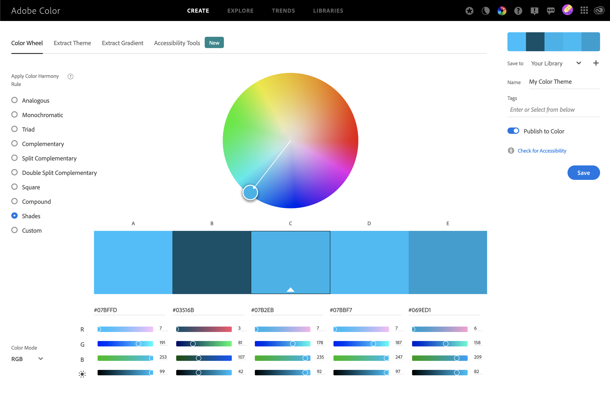

# Semester Project 2
_semester-project-2_

    
  

### Resources

Project Brief: [Noroff](https://noroff-content.gitlab.io/feu/semester-project-2/brief.html#required-links)    
Gantt Chart:    
Design Prototype: [Figma Prototype](https://www.figma.com/file/UyExWTgQEUySgt6Id8BKg1/Style-Tile?node-id=2%3A2&t=H3mrxOhAxbzwXgIE-0)    
Style Guide: Figma Style Tile  
Kanban Board: [Trello](https://trello.com/b/BqgXk4Ij/semester-project-2)    
Repository: [semesterproject2-1](https://github.com/siljeangelvik/semester-project-2)    
Hosted Demo: [semesterproject2-angelvik](https://semester-project-2.netlify.app/)  

---

## Getting started

### Planning: [Trello](https://trello.com/b/BqgXk4Ij/semester-project-2)  
Trello or GitHub Project  

### Design and Prototype : Figma
Figma, Adobe XD or Sketch  

Searched for a Finn.no image to find their color.  

Used Adobe-Wheel to add a secondary and tertiary color.  

### Bundler: Vite

`$ yarn create vite`  
`$ cd semester-project-2`  
`$ yarn`  
`$ yarn dev`  
`$ yarn run dev --host`  

Using `yarn` as package manager, instead of `npm`.  
The reason for this is it allows me to more simply manage `node_modules`,  
increased speed when installing modules, as well as simplified commands.  
It might not be as beneficial right now, making small projects,  
but I wish to implement it in my "routine" early on.

### CSS Processor: SASS/SCSS or PostCSS
SASS / PostCSS
### CSS Framework: TailWind
Tailwind / Bootstrap
### Hosting Services: Netlify
Netlify / GitHub Pages
### Planning Application: Trello
Trello / GitHub Project

---
### Resources
[Digital Ocean: Vite](https://www.digitalocean.com/community/tutorials/how-to-set-up-a-react-project-with-vite)  

### Tools
[Hex Color Picker](https://imagecolorpicker.com/en)  
[Adobe Color Wheel](https://color.adobe.com/create/color-wheel)  

### Docs
[Vite](https://vitejs.dev/guide/features.html)  

