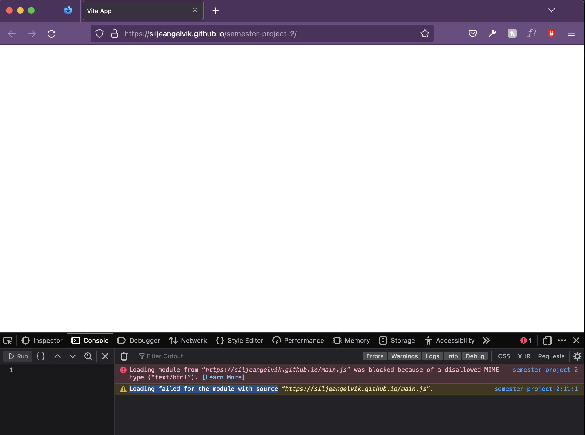

# Reminder Notes
## errors & warnings  

### MIME-type
**Error:**  
Loading module from “https://siljeangelvik.github.io/main.js” was blocked because of a disallowed MIME type (“text/html”).  
**Warning:**  
Loading failed for the module with source “https://siljeangelvik.github.io/main.js”.  
  

## git
### create a new branch
creating a new **feature-branch**:    
`$ git checkout -b <feature-branch>`  

### merge branch
go to the branch you want to **merge** with:  
`$ git checkout main`    
check **status** of current **branch**:   
`$ git status`  
merge **feature-branch** into **main** branch:  
`$ git merge <feature-branch>`  

_**note:** want to make an `onMerge` workflow_  

### push local branch to remote branch
standing in the branch you want to **push** to remote:    
`$ git push -u origin <remote-branch>`    

_**note:** I want `onPush` workflow to deploy to the hosting service_      

### delete local and remote branch
remove a **local branch:**    
`$ git branch -d <local-branch>`    

remove a **remote branch:**    
`$ git push origin -d <remote-branch>`